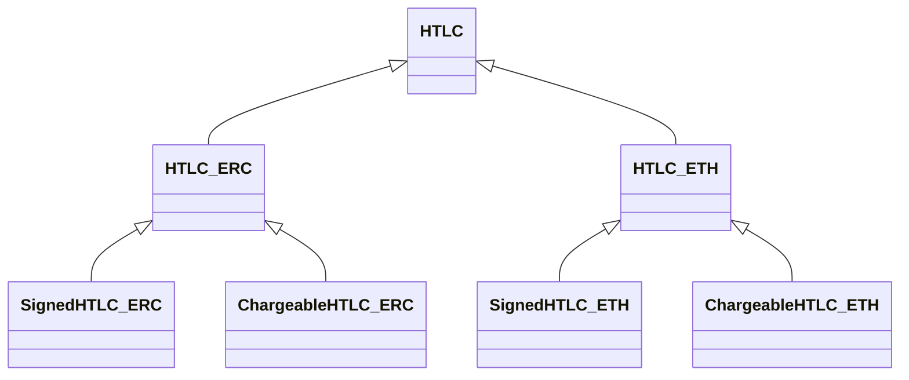
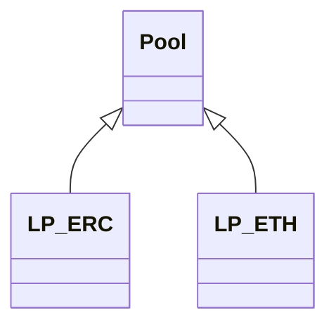

# bridge-contracts
EVM & Archethic smart contract for Archethic's Bridge

## Development
In order to develop and test the contracts, you need to have some prerequisites:

- Node.js
- EVM:
  - [Hardhat](https://hardhat.org/)

- Archethic:
  - Archethic node (running in devnet mode)
 
### Installation
```bash
npm install --prefix evm
npm install --prefix archethic
```

## EVM contracts

There are different kind of EVM smart contracts:
- HTLC
- Liquidity pools

All the contract have their own type depending on the token used: native or ERC, because transfers/balance verification acts differently.

### Audit of EVM Smart Contracts

Our EVM smart contracts have been audited by [Hacken](https://hacken.io), a recognized leader in blockchain security. The full audit report is available [here](https://wiki.archethic.net/assets/files/Hacken_Archethic_[SCA]%20Archethic%20_%20Bridge-Contracts%20_%20June2024_P-2024-692_1_20240722%2011_07-30521586ca69963b7d512e27e98e0ab3.pdf).

### HTLC

Those contract provide the atomic swap logic.

There are few types 

- Signed: contract where a signature from the Archethic's pool is required to provision the contract or to withdraw funds
- Chargeable: contract where a fee is defined and in which the pool is assigning the recipient



### Liquidity pools contracts



### Test SC 

```bash
cd evm
```

For tests you can use unit tests:
```bash
npm run test
```

To use the pool in a local environment you can use migrations with:
```bash
npm run start-node
```
```bash
npm run deploy
```

You can use script to fill the pools
```bash
npm run fill-erc
npm run fill-eth
```

You can also use script to deploy chargeable HTLC contract
```bash
npx hardhat run scripts/fixture/create_erc_chargeable_htlc.js --network localhost
npx hardhat run scripts/fixture/create_eth_chargeable_htlc.js --network localhost
npx hardhat run scripts/fixture/reveal_chargeable_secret.js --network localhost
```

This will create two pools for ETH and ERC.
It will also create a dummy token, accessible via `LP_ERC.token()`

### Analytics

In order to run some analytics from the pools, there are two scripts to run:

- UCO pool: 

This script will give swap statistics from the ERC pool using the chargeable and signed HTLC contracts.

```bash
npx hardhat run scripts/analytics/uco_bridged.js --network sepolia 
```

- ETH/MATIC/BSC pool: 

This script will give swap statistics from the ETH pool using the chargeable and signed HTLC contracts.

```bash
npx hardhat run scripts/analytics/coin_bridged.js --network sepolia 
```

## Archethic Smart Contracts

There is three kind of SC:
- Factory contract
- HTLC
- Pool contracts

### Factory contract

This contract is a helper for DApps UI and for Pool contracts to build and verify HTLC. It also helps Pool contracts for minting new tokens.

Here is the public functions: 
- `get_chargeable_htlc(end_time, user_address, pool_address, secret_hash, token, amount)`  
It returns the code of a HTLC for fund going from EVM chain => Archethic
    - `end_time`: the limit timestamp for the swap provided by EVM contracts
    - `user_address`: the destination address on Archethic
    - `pool_address`: the address of the Archethic pool to request funds
    - `secret_hash`: the hash of the secret generated by user
    - `token`: the token address to swap or "UCO"
    - `amount`: the amount of token the user wants to receive on Archethic

- `get_signed_htlc(user_address, pool_address, token, amount)`  
It returns the code of a HTLC for fund going from Archehtic => EVM chain
    - `user_address`: the user address on Archethic
    - `pool_address`: the address of the Archethic pool to request secret
    - `token`: the token address to swap or "UCO"
    - `amount`: the amount of token the user wants to receive on EVM chain

- `get_protocol_fee`  
It returns the protocol fees in percentage (0.3 => 0.3% = 0.003)

- `get_protocol_fee_address`  
It returns the address where the protocol fees are sent

### HTLC

Those contracts implement the logic of atomic swap. There is two types of contracts:
- Chargeable HTLC: used when swapping from EVM chain to Archethic.  
On creation, this contract needs to request funds to a pool. To do it the transaction that contains the code should also add the pool in the recipient with the parameters end_time, amount, user_address, secret_hash.  
Actions: 
    - `reveal_secret(secret)`: reveal the secret and withdraw the fund if secret match

- Signed HTLC: use when swapping from Archethic to EVM chain.  
Public functions:
    - `get_htlc_data`: After provisioning, this contract will expose this function which provide the needed data to create the HTLC contract on EVM side. It returns the endtime, the secret_hash and the secret_hash_signature.
    - `get_secret`: After withdraw, this contract will expose this funtion which provide the needed data to withdraw the contract on EVM side. It returns the secret and the secret_signature

### Pool Contracts

Those contract are responsible for creating new tokens and signing action to make a proof for EVM chain that actions has been done on Archethic.  
There is one contract version for token and one for UCO.  
This contract provides these actions:
- `request_funds(end_time, amount, user_address, secret_hash)`: This actions should be triggered on the chargeable htlc creation. It ensure the HTLC contract is valid and send the requested funds to the HTLC
- `request_secret_hash(htlc_genesis_address, amount, user_address, chain_id)`: This actions should be triggered by the user that already created a signed HTLC. In the trigger transaction, the user must add a transfer to the HTLC contract that contains the needed fund for the swap. The pool will ensure the contract is a valid one and the transfer correspond to the swap parameter, and then generate a new secret with a signature and send them to the HTCL contract
- `reveal_secret(htlc_genesis_address)`: This actions, should be triggered by the user. The pool will send the secret to the HTLC contract so it can withdraw.
- `update_pool(new_code)`: This action is used to update the pool code. It can be triggered only from the Master chain of the bridge

### Script example

To help interaction with smart contracts, some helper scripts are available in js.  
A `bridge.js` script can be used as entry point for any commands.  
A `config.js` file is provided to configure the environment with `endpoint`, `availableEvmNetworks`

```bash
cd archethic
```

```bash
node bridge --help

Commands:
  bridge deploy_pool             Deploy a pool
  bridge deploy_factory          Deploy the factory
  bridge update_pool             Update an existing pool
  bridge init_keychain           Initialize the bridge keychain with the primary services
  bridge deploy_chargeable_htlc  Deploy a chargeable HTLC to swap from EVM to Ar chethic
  bridge deploy_signed_htlc      Deploy a signed HTLC to swap from Archethic to EVM
  bridge reveal_secret           Reveal a secret to an HTLC contract when swappi ng from EVM to Archethic
  bridge provision_htlc          Provision a signed HTLC address and request the pool the create a secret
  bridge request_secret          Request a pool to reveal the secret for a HTLC contract
Options:
  --version  Show version number                                       [boolean]
  --help     Show help                                                 [boolean]
```

#### Setup bridge contracts
##### Initialize the keychain if not already existing
```bash
node bridge init_keychain --help

Initialize the bridge keychain with the primary services
Options:
  --access_seed  The Keychain access seed (default in env config)       [string]
  --env          The environment config to use (default to local)       [string]
```
```bash
node bridge init_keychain
```
##### Create factory contract
To update factory contract the same command can be used
```bash
node bridge deploy_factory --help

Deploy the factory
Options:
  --access_seed  The Keychain access seed (default in env config)       [string]
  --env          The environment config to use (default to local)       [string]
```
```bash
node bridge deploy_factory
```
##### Deploy a pool
```bash
node bridge deploy_pool --help

Deploy a pool
Options:
  --token        The token to create a pool, UCO or token symbol       [string] [required]
  --access_seed  The Keychain access seed (default in env config)      [string]
  --env          The environment config to use (default to local)      [string]
```
```bash
node bridge deploy_pool --token UCO
node bridge deploy_pool --token aeETH
```
##### Update a pool's code
```bash
node bridge update_pool --help

Update an existing pool
Options:
  --token        The token of the pool to update, UCO or token symbol   [string] [required]
  --access_seed  the keychain access seed (default in env config)       [string]
  --env          The environment config to use (default to local)       [string]
```
```bash
node bridge update_pool --token UCO
```

#### Swap EVM => Archethic

First deploy HTLC contract on EVM

##### Deploy chargeable HTLC contract

```bash
node bridge deploy_chargeable_htlc --help

Deploy a chargeable HTLC to swap from EVM to Archethic
Options:
  --token        The token to receive on Archethic                    [string] [required]
  --seed         The seed to use for create the HTLC contract         [string] [required]
  --endtime      The end time provided by the EVM contract            [required]
  --amount       The amount to receive from the swap                  [required]
  --secret_hash  The hash of the secret                               [string] [required]
  --access_seed  the keychain access seed (default in env config)     [string]
  --env          The environment config to use (default to local)     [string]
```
```bash
node bridge.js deploy_chargeable_htlc --token UCO --seed htlc1 --endtime 1696934940 --amount 14.35 --secret_hash 31f7a65e315586ac198bd798b6629ce4903d0899476d5741a9f32e2e521b6a66
```
Withdraw on EVM

##### Reveal secret

```bash
bridge reveal_secret --help

Reveal a secret to an HTLC contract when swapping from EVM to Archethic
Options:
  --htlc_address  The address of the HTLC contract                  [string] [required]
  --secret        The secret allowing the contract to withdraw      [string] [required]
  --env           The environment config to use (default to local)  [string]
```
```bash
node bridge reveal_secret 0000b900c36b959d1b2eb52db6237e5130fe07a022e17e671656065d1b5e56bda713 toto
```

#### Archethic => EVM

##### Deploy signed HTLC

```bash
node bridge deploy_signed_hltc --help

Deploy a signed HTLC to swap from Archethic to EVM
Options:
  --token        The token to send to EVM                             [string] [required]
  --seed         The seed to use for create the HTLC contract         [string] [required]
  --amount       The amount to send to the swap                       [required]
  --access_seed  the keychain access seed (default in env config)     [string]
  --env          The environment config to use (default to local)     [string]
```
```bash
node bridge deploy_signed_htlc --token UCO --seed htlc1 --amount 5.356
```

##### Provision HTLC

```bash
node bridge provision_htlc --help

Provision a signed HTLC address and request the pool the create a secret
Options:
  --token         The token to send to the htlc contract                    [string] [required]
  --htlc_address  The genesis address of the HTLC contract to provision     [string] [required]
  --amount        The amount to send to the htlc contract                   [required]
  --chainID       The chain ID of the destination EVM blockchain
  --access_seed   the keychain access seed (default in env config)          [string]
  --env           The environment config to use (default to local)          [string]
```

```bash
node bridge provision_htlc --token UCO --htlc_address 0000b900c36b959d1b2eb52db6237e5130fe07a022e17e671656065d1b5e56bda713 --amount 5.356
```

Create EVM contract on EVM using data provided by HTLC function `get_htlc_data`

##### Request secret to the pool

```bash
node bridge request_secret --help

Request a pool to reveal the secret for a HTLC contract
Options:
  --token         The token of the pool (used to retrieve pool address)     [string] [required]
  --htlc_address  The genesis address of the HTLC contract                  [string] [required]
  --access_seed   the keychain access seed (default in env config)          [string]
  --env           The environment config to use (default to local)          [string]
```
```bash
node bridge.js request_secret --token UCO --htlc_address 0000b900c36b959d1b2eb52db6237e5130fe07a022e17e671656065d1b5e56bda713
```
